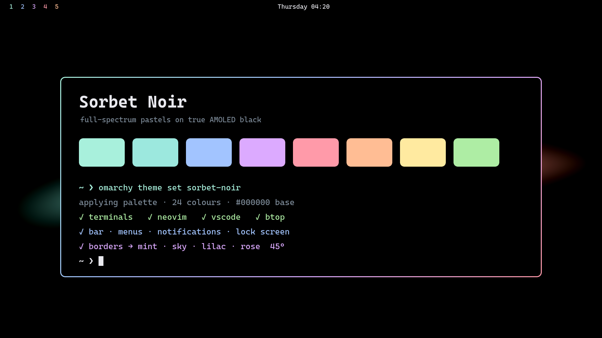
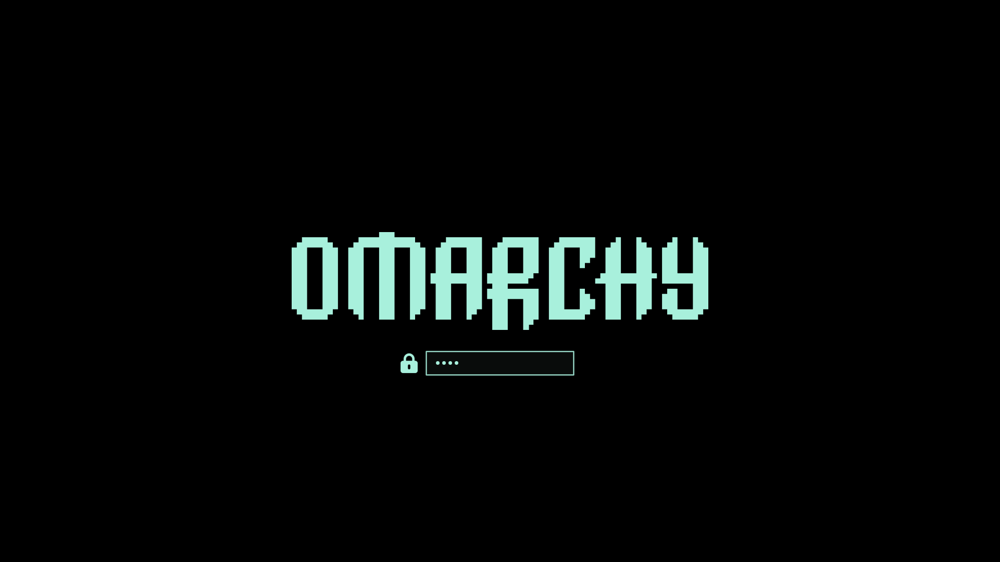

# Sorbet Noir

A full-spectrum pastel theme for [Omarchy](https://omarchy.org/) on true AMOLED black.

Every surface sits on `#000000` — pixels literally off — with a soft pastel
spectrum layered on top and mint as the accent. The focused window wears a
four-stop pastel ribbon (mint → sky → lilac → rose).



## Install

From the menu: **Install → Style → Theme**, then paste this repository's URL.

Or from a terminal:

```bash
omarchy theme install https://github.com/isti2415/omarchy-sorbet-noir-theme
omarchy theme set sorbet-noir
```

Pairs well with:

```bash
omarchy font set "CaskaydiaMono Nerd Font"
```

Optionally style the boot and unlock screen to match:

```bash
omarchy plymouth set by theme sorbet-noir
```

## Palette

| Role | Hex | | Role | Hex |
|---|---|---|---|---|
| background | `#000000` | | red / rose | `#ff9aa9` |
| lighter surface | `#14141b` | | orange / peach | `#ffbd94` |
| foreground | `#e9e9ef` | | yellow / butter | `#ffeaa0` |
| dim text | `#7d8b99` | | green / spring | `#aeeda4` |
| comments | `#8a95a6` | | cyan / aqua | `#9ce8de` |
| **accent (mint)** | **`#a8f0dc`** | | blue / sky | `#a2c4ff` |
| selection | `#1c3b35` | | magenta / lilac | `#dcaaff` |

`background`, `dark_background` and `darker_background` are all `#000000` by
design. The dim greys are deliberately lifted — the usual `#4e5a63`-ish muted
tone that reads fine on a `#1e1e2e` base becomes unreadable on true black.

## What's included

| File | Themes |
|---|---|
| `colors.toml` | the palette, plus the Hyprland border gradient |
| `shell.toml` | bar, launcher, menus, notifications, tooltips, polkit, lock screen |
| `icons.theme` | Yaru-sage-dark |
| `keyboard.rgb` | mint, for supported RGB keyboards |
| `unlock.png` | mint Omarchy wordmark for the Plymouth boot/unlock screen |
| `preview-unlock.png` | preview of that unlock screen |
| `backgrounds/` | four generated AMOLED backgrounds |
| `preview.png` | marketplace/README preview |
| `hyprland.lua` | mint bloom + groupbar tint — **see the caveat below** |

Terminals (Alacritty, foot, kitty, Ghostty), Neovim, VS Code, btop, Chromium,
Obsidian and Helix are all generated from `colors.toml` by Omarchy's own
templates, so they match without this theme shipping anything for them.

## Important: what `omarchy theme install` drops

Omarchy strips every `*.lua` from a theme installed from a git repo, because a
theme's `hyprland.lua` runs code at login. It detects a cloned theme by the
`.git` directory the clone leaves behind.

**The border gradient survives** — it lives in `colors.toml` as
`hyprland_active_border`, which is colour, not code.

**The mint glow does not.** To get it back, append
[`extras/glow.lua`](extras/glow.lua) to your `~/.config/hypr/looknfeel.lua`:

```bash
cat extras/glow.lua >> ~/.config/hypr/looknfeel.lua
hyprctl reload
```

If you'd rather not clone at all, copy the theme in by hand instead and nothing
is stripped:

```bash
git clone https://github.com/isti2415/omarchy-sorbet-noir-theme /tmp/sorbet-noir
rm -rf /tmp/sorbet-noir/.git          # <- this is what makes it "yours"
cp -r /tmp/sorbet-noir ~/.config/omarchy/themes/sorbet-noir
omarchy theme set sorbet-noir
```

## Optional extras

None of these are part of the theme — they're personal-config changes that
happen to complement it. Back up the file you're replacing first.

### Look & feel: rounded, airy, flowy

[`extras/looknfeel.lua`](extras/looknfeel.lua) is a complete
`~/.config/hypr/looknfeel.lua`: rounding 10, gaps 4/6, border 2, dimmed
inactive windows, blur tuned so popups don't crush an all-black desktop into a
void, and slower easing on three custom bezier curves.

```bash
cp ~/.config/hypr/looknfeel.lua ~/.config/hypr/looknfeel.lua.bak
cp extras/looknfeel.lua ~/.config/hypr/looknfeel.lua
hyprctl reload && hyprctl configerrors
```

If you install this, it already contains the glow — don't also append
`extras/glow.lua`.

### Pastel workspace indicators

Stock workspace numbers render in a single bar-foreground colour.
[`extras/workspaces/Workspaces.qml`](extras/workspaces/Workspaces.qml) gives
each workspace its own pastel hue — 1 mint, 2 sky, 3 lilac, 4 rose, 5 peach,
and on through the palette.

Clone the built-in widget first so the plugin id matches *your* username, then
overwrite just the QML:

```bash
omarchy plugin clone omarchy.workspaces
cp extras/workspaces/Workspaces.qml ~/.config/omarchy/plugins/"$USER".workspaces/
omarchy restart shell
```

## Backgrounds

Four backgrounds ship here, all generated from the palette and MIT-licensed
with the rest of the repo:

| | |
|---|---|
| `1-pure-black` | solid `#000000` — truest AMOLED, best battery |
| `2-mint-bloom` | two whisper-soft corner glows that decay to true black |
| `3-aurora-ribbon` | the full pastel spectrum sweeping across black |
| `4-drift` | sparse pastel stars |

They're 2560×1440. Regenerate at any resolution:

```bash
python3 tools/generate-backgrounds.py 3840 2160 backgrounds
```

Four community wallpapers from [Wallhaven](https://wallhaven.cc/) also pair
well, but they're third-party uploads with their own rights holders, so they
are **not** redistributed here. Fetch them yourself:

```bash
./tools/fetch-extra-backgrounds.sh
```

That pulls [4xz98z](https://wallhaven.cc/w/4xz98z),
[573kd1](https://wallhaven.cc/w/573kd1),
[k88m2m](https://wallhaven.cc/w/k88m2m) and
[ymxr2d](https://wallhaven.cc/w/ymxr2d). Credit belongs to their original
authors; check each page before redistributing.

Cycle backgrounds with `omarchy theme bg next`.

## Tuning

| Want | Where |
|---|---|
| softer / stronger glow | `extras/glow.lua` — alpha in `rgba(a8f0dc20)`, and `range` |
| tighter / airier windows | `extras/looknfeel.lua` — `gaps_in`, `gaps_out` |
| a different accent | `colors.toml` — `accent`, and the first stop of `hyprland_active_border` |
| solid border, no gradient | `colors.toml` — set `hyprland_active_border = "rgba(a8f0dcff)"` |
| less see-through popups | `shell.toml` — `background-alpha`, `scrim-alpha` |

## Boot & unlock screen

`unlock.png` is the Omarchy wordmark tinted to the mint accent, which puts this
theme in `omarchy plymouth list`:

```bash
omarchy plymouth set by theme sorbet-noir   # apply
omarchy plymouth reset                      # back to the Omarchy default
```



## License

MIT — see [LICENSE](LICENSE). Applies to the theme files and the four generated
backgrounds. It does not extend to the Wallhaven wallpapers referenced above,
nor to the Omarchy wordmark in `unlock.png`, which belongs to the Omarchy
project and is included per the theming manual's convention.
